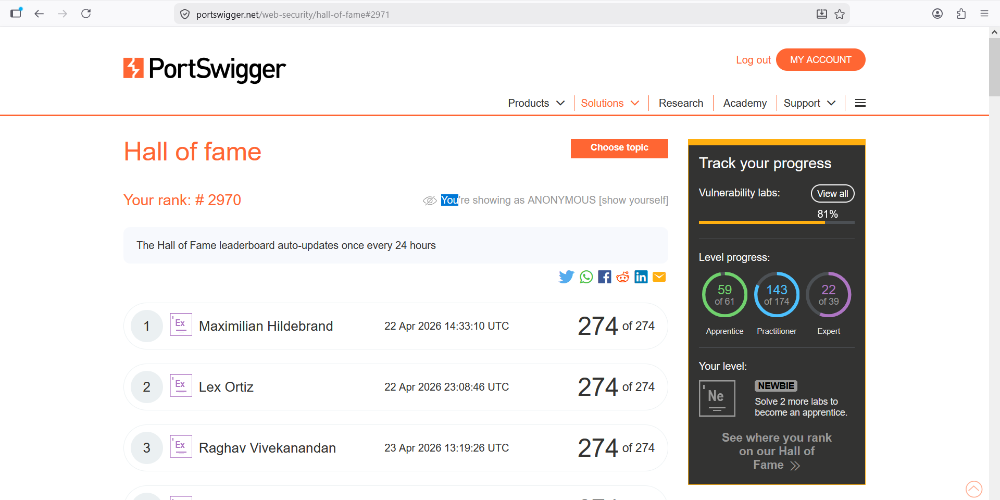
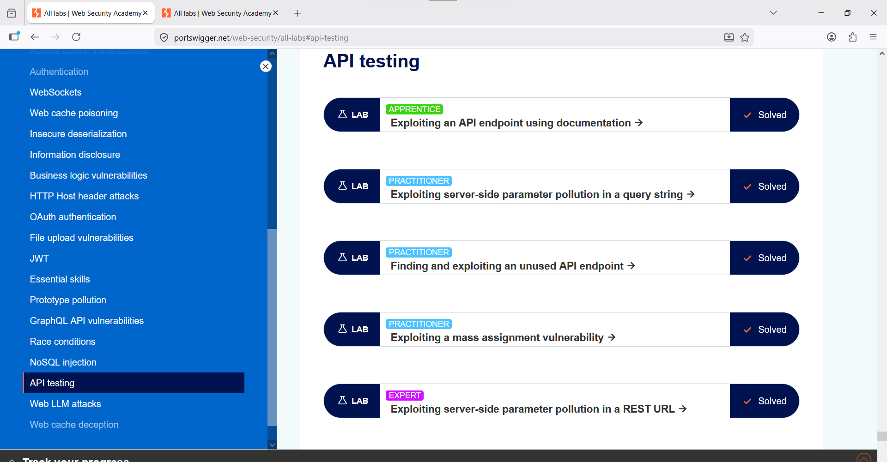
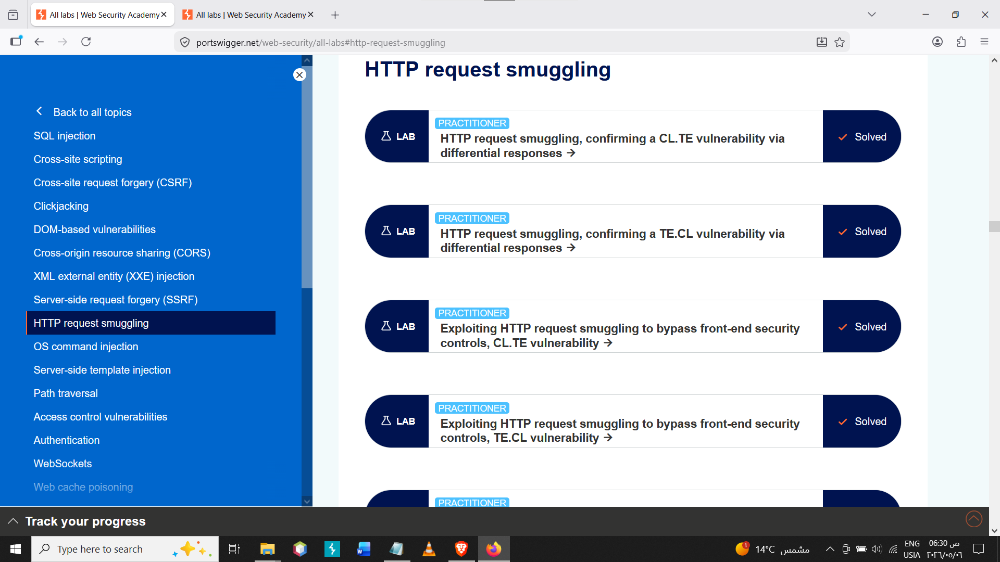

# PortSwigger Web Security Academy Progress

This repository documents my hands-on practice and progress on PortSwigger Web Security Academy labs as part of my web application security and penetration testing learning path.

## Progress Summary

- Overall vulnerability labs progress: 81%
- Apprentice level: 59 / 61 labs
- Practitioner level: 143 / 174 labs
- Expert level: 22 / 39 labs

## Topics Practiced
- Cross-Site Scripting (XSS)
- Cross-Site Request Forgery (CSRF)
- Clickjacking
- Cross-Origin Resource Sharing (CORS)
- WebSockets
- DOM-based vulnerabilities
- SQL Injection
- Authentication Vulnerabilities
- Access Control Vulnerabilities
- File Upload Vulnerabilities
- Server-Side Request Forgery (SSRF)
- XXE Injection
- Command Injection
- Path Traversal
- Business Logic Vulnerabilities
- Race Conditions
- API Testing
- Web cache deception
- Information disclosure vulnerabilities 
- JWT Attacks
- OAuth Authentication
- GraphQL API Vulnerabilities
- HTTP Request Smuggling
- Web Cache Poisoning
- HTTP Host Header Attacks
- Server-Side Template Injection
- Web LLM Attacks
- Insecure deserialization

## Methodology

My approach during labs focuses on:

- Understanding the vulnerability concept before exploitation.
- Identifying vulnerable inputs and application behavior.
- Testing manually using Burp Suite and browser developer tools.
- Documenting the root cause, impact, and remediation idea.
- Avoiding copy-paste solutions and focusing on learning the testing process.

## Evidence

The screenshots below show my PortSwigger Web Security Academy progress and sample solved labs.

### Progress Overview

### Sample Solved Labs

## Notes

This repository does not contain sensitive payloads, private lab solutions, or copied walkthroughs. It is intended to show learning progress, practiced topics, and hands-on exposure to web application security concepts.
